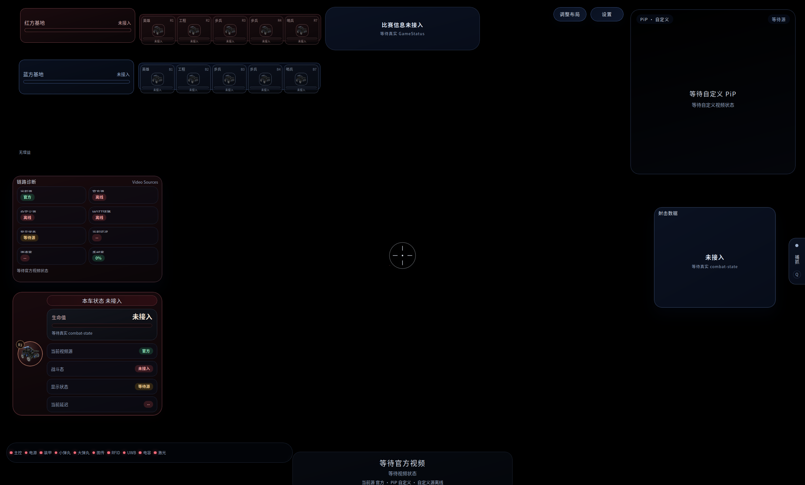
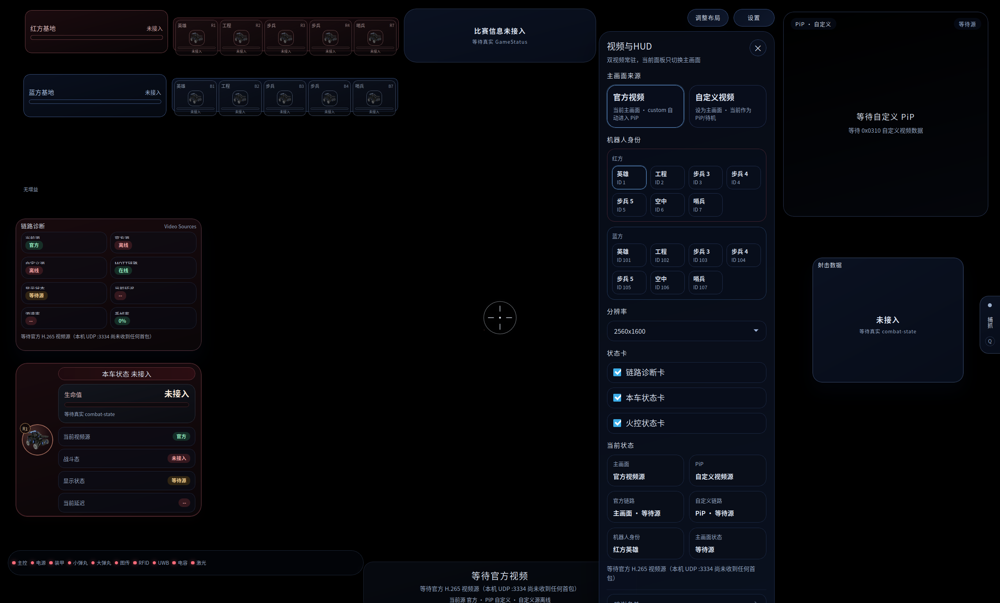
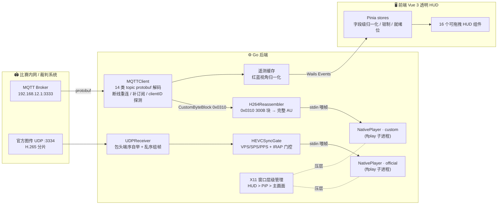

# AURORA CLIENT

**RoboMaster 2026 赛季自定义客户端 —— 透明 HUD 叠加原生低延迟视频的 Linux 选手端**


> 本项目为参赛队自研的第三方选手端，与 DJI / RoboMaster 组委会无关。"RoboMaster" 是大疆创新的商标。
> 客户端面向比赛/受信内网环境（裁判系统链路为明文 MQTT，协议如此），请勿将其暴露到公网。

* * *

## 📑 目录

- [✨ 亮点](#-亮点)
- [🚀 运行效果](#-运行效果)
- [🧭 功能状态](#-功能状态)
- [🛠 从零开始部署](#-从零开始部署)
- [⚙️ 运行配置](#️-运行配置)
- [🔄 数据流与软件架构](#-数据流与软件架构)
- [📂 文件结构](#-文件结构)
- [🧠 技术细节](#-技术细节)
- [👨‍💻 作者](#-作者)
- [🔗 相关项目](#-相关项目)
- [🙏 鸣谢](#-鸣谢)
- [📝 后记](#-后记)

* * *

## ✨ 亮点

- **视频不进 WebView**：画面由原生 `ffplay` 子进程渲染，Wails 窗口只是一层全屏透明置顶 HUD，靠 X11 窗口层级管理把视频窗稳定锁在 HUD 正下方——绕开浏览器解码/合成整条延迟路径，`-probesize 32 -sync ext` 等参数把 ffplay 压到最低延迟，配合 2 帧极小队列「保最新丢最旧」，宁丢帧不积压。

- **双视频源常驻热切换**：官方 H.265 图传（UDP `:3334`）与自定义 H.264 链路（裁判系统 0x0310 图传）两路 ffplay 同时运行，主画面/画中画一键互换——切换只改窗口布局，**不重启解码进程**。自研 H.264 重组器把 0x0310 的 300B 无边界字节块恢复成完整访问单元，支持码流中途切入与断流自动重同步。

- **裁判系统全量遥测 HUD**：MQTT（RMCP V1.2.0 protobuf）14 类主题解码桥接，驱动 16 个可自由拖拽布局的 HUD 组件（血量/比分/火控/经济/模块自检/增益/裁判事件…）。

* * *

## 🚀 运行效果





* * *

## 🧭 功能状态

| 功能 | 状态 | 说明 |
|---|:---:|---|
| 官方 H.265 图传（UDP 组帧 + 同步门控） | ✅ | 现役 |
| 自定义 H.264 图传（0x0310 链路重组） | ✅ | 现役，主/PiP 热切换 |
| 裁判系统遥测 HUD（14 类 topic） | ✅ | 现役，未接入时显式显示"未接入" |
| HUD 自由布局编辑与持久化 | ✅ | 现役（`L` 键编辑，`P` 键设置） |
| 机器人身份运行时切换 + clientID 自动探测 | ✅ | 现役，红蓝全兵种 |

> 由于战术转变，自定义客户端目前仍无法替换官方客户端。以下功能仅为开发过程中的代码保留，**并无实际作用**：

| 功能 | 状态 | 说明 |
|---|:---:|---|
| 键鼠控制下发 | ❌ | 前端捕获链路完整，后端绑定未接通 |
| 一键买弹 | ❌ | 按键会提示"买弹接口不可用" |
| 装甲受击线条闪烁 | ❌ | 后端事件已发出，前端订阅未接 |
| SVG 图形标注编辑器 | 💤 | 功能完整，入口暂时下线 |
| 雷达 / 态势感知叠层 / 跑马灯 | 💤 | 刻意下线，代码保留 |

* * *

## 🛠 从零开始部署

本指南假设你有一台全新的 Linux 机器，从零出发完整搭建开发环境。

> 目前仅在 **Debian 13 (Trixie)** 上完整测试通过。

### 📦 系统依赖

#### 1. 安装 Go

Aurora Client 要求 **Go ≥ 1.25**：

```bash
sudo apt install golang

go version
```

#### 2. 安装 Node.js

前端 Vite 7 构建要求 **Node.js ≥ 20.19**。

```bash
sudo apt install nodejs npm

node --version
npm --version
```

#### 3. 安装 Wails CLI

```bash
go install github.com/wailsapp/wails/v2/cmd/wails@latest

# 确保 $HOME/go/bin 在 PATH 中
echo 'export PATH=$HOME/go/bin:$PATH' >> ~/.bashrc
source ~/.bashrc

wails version
```

#### 4. 安装系统库与 FFmpeg

```bash
sudo apt install libwebkit2gtk-4.1-dev libgtk-3-dev ffmpeg
```

关键依赖说明：

| 依赖 | 作用 |
|------|------|
| `webkit2gtk-4.1` | Wails WebView 运行时（构建 tag `webkit2_41`） |
| `gtk3` | 窗口系统 |
| `ffmpeg`（含 `ffplay`） | 视频渲染进程，启动期检测，缺失直接报错 |

### ⚡ 快速开始

```bash
git clone https://github.com/asterShining/Robomaster_Aurora_Client
cd Robomaster_Aurora_Client

# 开发模式（热重载）
make dev
```

> 未装 Wails CLI 时自动降级为纯前端 Vite dev server。

* * *

## ⚙️ 运行配置

运行时配置在客户端内完成（`P` 键打开设置面板）：

- 机器人身份（红蓝全兵种）
- 主画面视频源（官方 / 自定义）
- HUD 布局（`L` 键进入编辑模式，拖拽自由布局）

配置持久化于 `~/.config/rm-aurora/ui-config.json`（原子写入，坏文件自愈）。

### 环境变量

| 变量 | 默认 | 作用 |
|---|---|---|
| `RM_MQTT_HOST` | `192.168.12.1` | 裁判系统 MQTT broker 地址 |
| `RM_MQTT_PORT` | `3333` | broker 端口 |
| `RM_OFFICIAL_UDP_PORT` | `3334` | 官方图传 UDP 监听端口 |
| `RM_DISABLE_OFFICIAL_UDP` | 空 | 置 `1` 跳过官方图传绑定 |

> 💡 首次运行且未选择身份时，客户端会逐个探测裁判系统接受的 clientID；不在赛场网络时最坏可能等待约半分钟。
> 💡 多台客户端共用一个测试 broker 时请在设置页显式选择各自身份。

### 快捷键

| 按键 | 功能 |
|------|------|
| `P` | 打开/关闭设置面板 |
| `L` | 进入/退出 HUD 布局编辑模式 |
| `O` | 一键买弹（未接通） |
| `F` | 切换主画面视频源 |

* * *

## 🔄 数据流与软件架构



关键设计：真正的视频窗是 ffplay 原生窗口，Wails/WebView 只承载透明 HUD；X11 层级管理循环持续把两路视频窗压在 HUD 正下方（五级搜窗回退 + 几何回读校验），多屏换屏、窗口重排后 2s 内自愈。

* * *

## 📂 文件结构

```
.
├── main.go                          # Wails 引导：透明全屏 HUD 窗、Wayland→XWayland 兜底
├── app.go                           # 核心枢纽：生命周期 / 双视频源调度 / 裁判系统桥接
├── pkg/
│   ├── network/                     # MQTT 客户端（重连/补订阅/clientID 探测）、UDP 组帧器
│   ├── video/                       # H.264 AU 重组、HEVC 同步门、ffplay 托管、X11 层级
│   ├── rmcp/                        # RMCP V1.2.0 protobuf 协议定义（30+ 消息）
│   └── config/                      # 用户配置持久化（原子写入 / 坏文件自愈）
├── cmd/
│   ├── local_custom_bridge_sim/     # 自定义链路仿真器（PTY 串口 + 内嵌 MQTT broker）
│   └── local_official_udp_injector/ # 官方图传注入器（合成 HEVC 分片）
├── frontend/
│   ├── src/store/                   # Pinia：遥测 / 输入捕获 / HUD 布局 / 图形 / 设置
│   ├── src/components/hud/          # 现役 HUD 组件（core / widgets / primitives / icons）
│   ├── src/composables/             # 键位映射、态势增强器
│   ├── src/services/                # HUD 方案导入导出、图片素材管线
│   └── tests/hud/                   # Playwright E2E + 视觉回归
├── Makefile                         # make dev / make build / make clean
└── wails.json
```

* * *

## 🧠 技术细节

| 主题 | 代码 | 一句话 |
|---|---|---|
| 0x0310 H.264 重组 | `pkg/video/h264_reassembler.go` | 300B 无边界字节块流恢复完整 AU：自带 Exp-Golomb 位读取器解析 `first_mb_in_slice` 判帧界（兼容 x264 sliced-threads），中途切入时缓存 SPS/PPS、等可恢复 IDR 才解锁 |
| HEVC 同步门 | `pkg/video/hevc_sync_gate.go` | 只放行 VPS/SPS/PPS+IRAP 齐全的关键帧作解码起点，防止 ffplay 中途起播秒退；关键帧缓存为 bootstrap，播放器重建后回放 |

| clientID 自动探测 | `pkg/network/mqtt_client.go` | 绕过 paho 手工构造最小 CONNECT/CONNACK 握手，逐个试探候选机器人 ID，广播 identifier rejected 时自动横向回退 |
| X11 窗口层级 | `pkg/video/x11_window_layer.go` | 五级搜窗回退（PID+标题→标题→PID+class→PID+几何→class+几何，含递归 QueryTree 抓 XWayland 深层子窗）+ EWMH sibling 压层 + 几何回读校验 |
| 帧新鲜度调度 | `pkg/video/native_player.go` | 2 帧队列保最新丢最旧 + 120ms 过期淘汰；写管道失败自动重启进程并联动重置同步门；后台 Wait 无僵尸回收 |

* * *

## 👨‍💻 作者

- [**Aster**](https://github.com/asterShining) —— 设计与开发

## 🔗 相关项目

- [custom_image_bridge_arch](https://github.com/asterShining/custom_image_bridge_arch) —— 下位机，图传桥接固件与架构文档
- [Pacific_doorlock_sniper](https://github.com/asterShining/Pacific_doorlock_sniper) —— 上位机，相机采集与 H.264 编码传输

## 🙏 鸣谢

**开源社区**

感谢 [Wails](https://wails.io)、[FFmpeg](https://ffmpeg.org)、[Eclipse Paho](https://github.com/eclipse/paho.mqtt.golang)、[Vue](https://vuejs.org)、[Vite](https://vitejs.dev)、[Pinia](https://pinia.vuejs.org)、[Tailwind CSS](https://tailwindcss.com)、[Protobuf](https://protobuf.dev) 等优秀开源项目及其社区。正是这些项目让个人开发者也能构建出完整的桌面应用。

**思路来源**

感谢 RoboMaster 论坛社区中各参赛队分享的优质开源项目与技术文章，为本项目的架构设计提供了宝贵的参考与启发。

**个人（老队员）**

- **张天乐** —— 英雄电控
- **聂政华 (Neomelt)** —— 哨兵导航，项目初期技术选型与全程思路点拨

## 📝 后记

首先，想向大家说声抱歉。坦白讲，目前的自定义客户端仍存在不少缺陷与漏洞。

在项目初期，队里并没有人专门负责自定义客户端的开发。出于个人兴趣，也是希望能借此机会学习软件开发，我主动接手了这项工作。然而，由于整体备赛进度非常紧张，加之我还需要同时兼顾英雄机器人的电控部分，双线作战让我很难抽出足够的心力去持续学习和完善这个客户端。感谢大家的理解与包容。

## 📄 License

[Apache-2.0](LICENSE)

内嵌字体 [Nunito](https://fonts.google.com/specimen/Nunito) 遵循 SIL OFL 1.1（见 `frontend/src/assets/fonts/OFL.txt`）。
